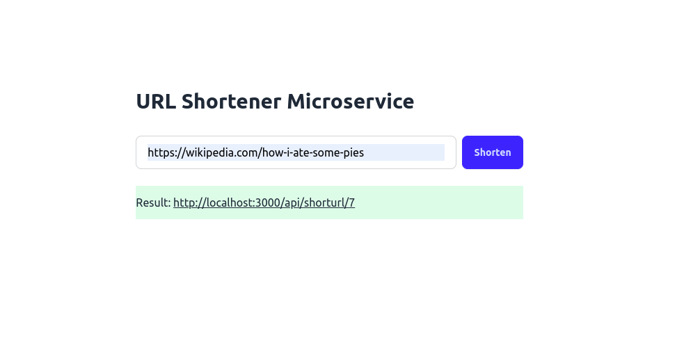

# [URL Shortener Microservice]

Is a microservice for shortening URLs. You give it a long URL and it can shorten that for you. If you can later use that shortened URL to to the original URL




## Applications
- Simplifying Long URLs
- Social Media Sharing
- Marketing Campaigns
- Email Campaigns
- SMS Campaigns
- Link Click Tracking and Analytics
- QR Code Generation
- Custom Branded Links
- A/B Testing for Links
- User-Friendly Links for Printed Materials
- Affiliate Link Management
- URL Management and Organization
- Monitoring Link Performance
- Expiring or One-Time Use Links
- Redirecting Users Based on Location or Device Type

## Tech Stack
- Express JS (Server)
- Mongo DB (Database)
- React JS + Tailwind CSS (Frontend)
- Docker (Containerization)
- Jest (Testing)

## Installation (Server)

**1. Clone the repo**
```sh
git clone https://github.com/takumade/url-shortener.git
```

**2. Install Dependencies**
```sh
cd url-shortener && npm i
```

**3. Configure and run**

Config you `.env` file. Check the `sample.env`

```env
PORT=3000
MONGO_URL=<mongo-url>
```

And run
```sh
npm run dev
```


## Installation (Frontend)

**1. Clone the repo**
```sh
git clone https://github.com/takumade/url-shortener.git
```

**2. Install Dependencies**

In `url-shortener` folder do this
```sh
cd frotend && npm i
```


**3. Configure and run**

Config you `.env` file

```env
VITE_API_ENDPOINT=3000
```

**4. Run**

And run
```sh
npm run dev
```

## Containerizing

You can also run this app in a docker container.

### Server

**1. Review and add changes**
Review  the Dockerfile and build.sh scripts and edit some changes

**2. Build the script**
Make the script executable:

```sh
chmod +x build.sh
```

Run it:

```sh
./build.sh
```

### Frontend

Can build it and pack it inside server but if you are a purist then take the following steps


**1. Navigate to frontend directory**
Go to the dashbaord folder

```sh
cd frontend
```

**2. Build the script and run**


```sh
docker build -t frontend -f ./Dockerfile .

docker run -p 5173:80 frontend
```
